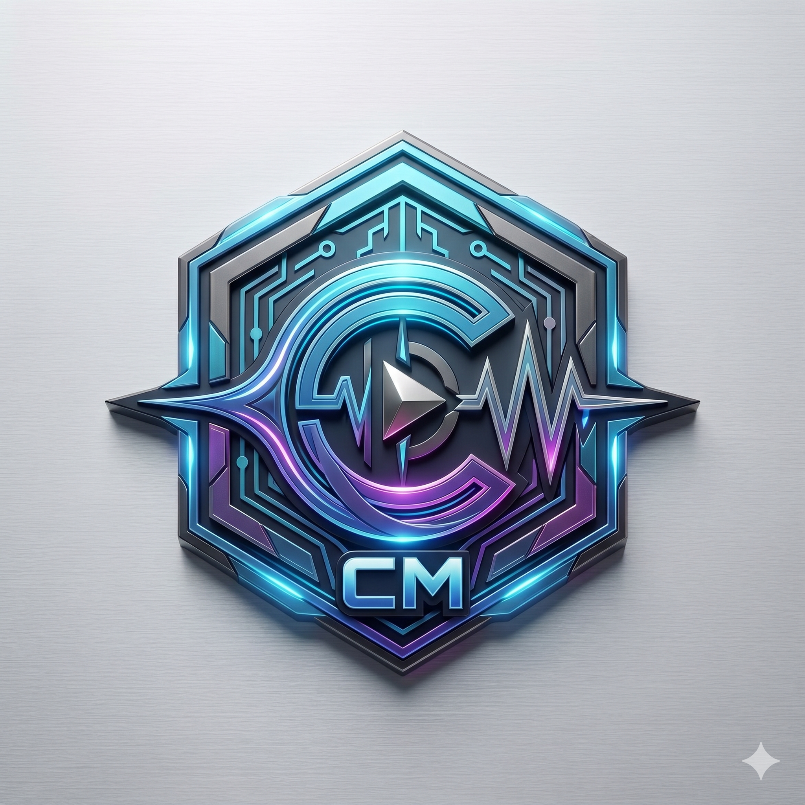
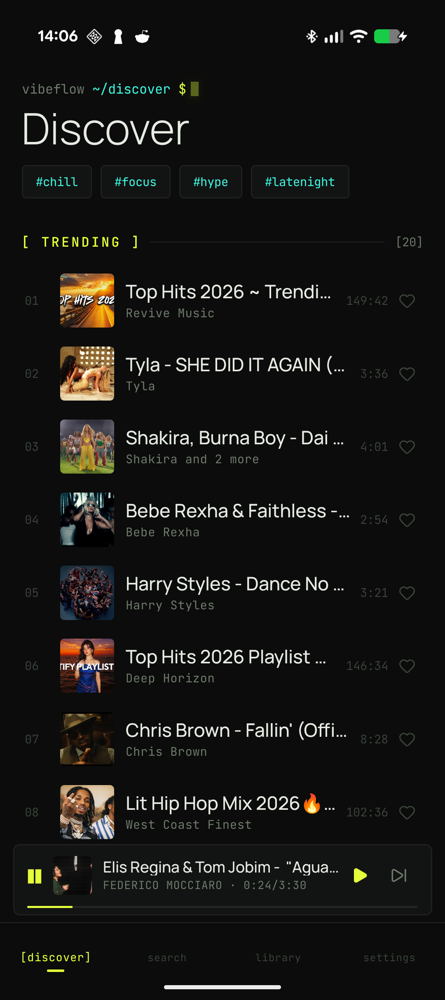
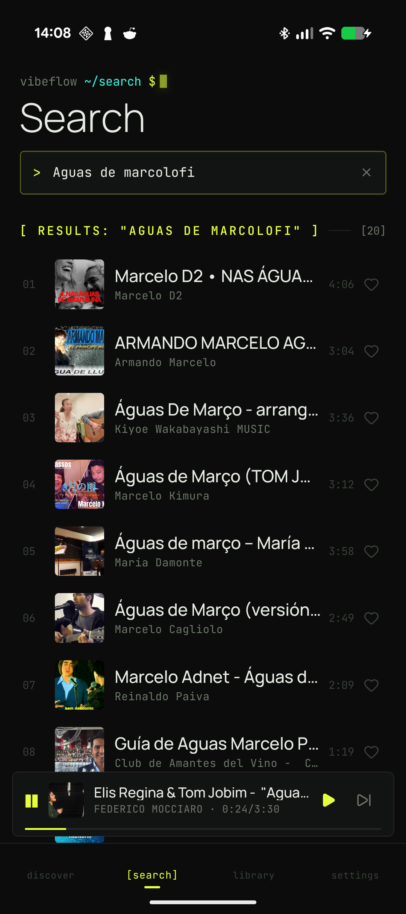
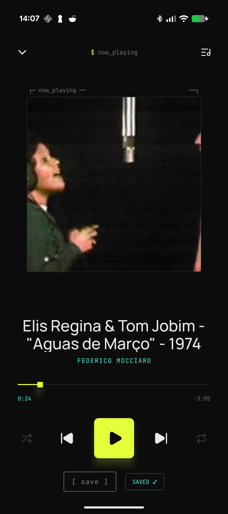
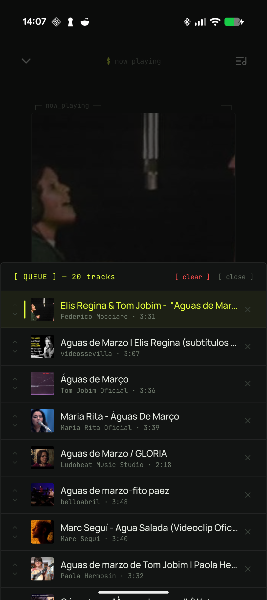
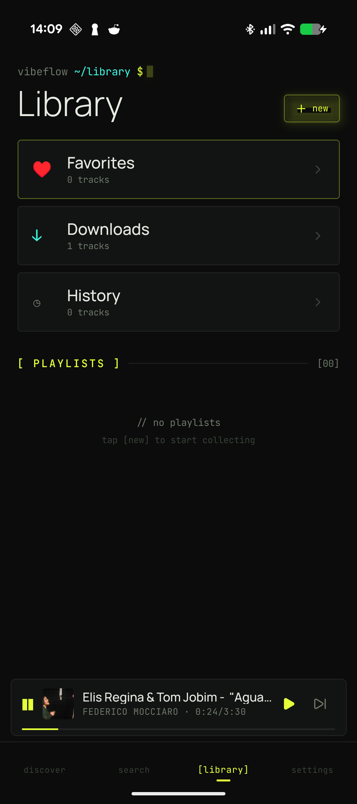
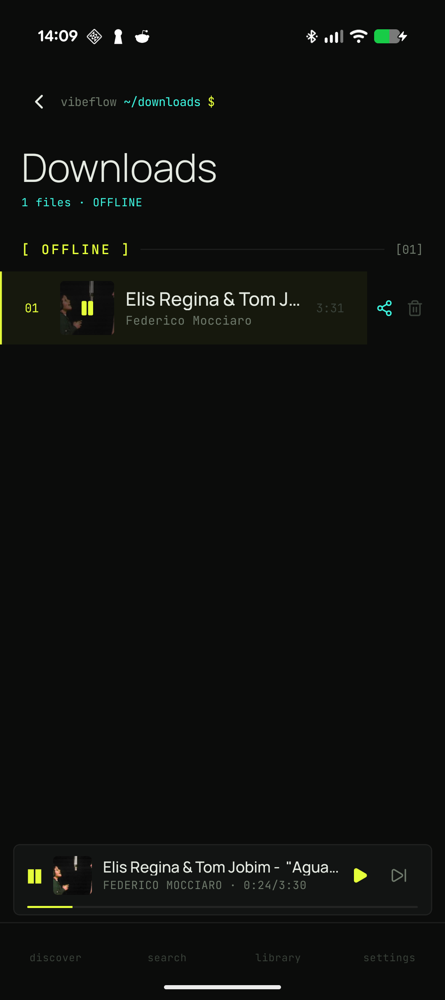

<div align="center">
  
  <h1 align="center">VibeFlow</h1>
  <p align="center">
    <strong>Reproductor de música desde YouTube</strong>
    <br />
    Android · Expo · React Native
  </p>
  <p align="center">
    <a href="#características">Características</a> ·
    <a href="#capturas">Capturas</a> ·
    <a href="#stack">Stack</a> ·
    <a href="#build">Build</a> ·
    <a href="#arquitectura">Arquitectura</a>
  </p>
  <br />
</div>

## 📱 Qué es VibeFlow

VibeFlow es un reproductor de música nativo para Android que reproduce audio directo desde YouTube. Buscá canciones, creá playlists, descargá temas para escuchar offline y manejá tu cola de reproducción — todo desde una interfaz con temática retro-terminal.

Sin anuncios, sin cuentas, sin vueltas. Ponés un video de YouTube y suena.

<br />

## 📸 Capturas

<div align="center">
  <table>
    <tr>
      <td align="center"><b>Discover</b></td>
      <td align="center"><b>Search</b></td>
      <td align="center"><b>Player</b></td>
    </tr>
    <tr>
      <td></td>
      <td></td>
      <td></td>
    </tr>
    <tr>
      <td align="center"><b>Queue</b></td>
      <td align="center"><b>Library</b></td>
      <td align="center"><b>Downloads</b></td>
    </tr>
    <tr>
      <td></td>
      <td></td>
      <td></td>
    </tr>
  </table>
  <p><i>Vista rápida de las pantallas principales</i></p>
</div>

<br />

## ✨ Características

| Feature | Detalle |
|---------|---------|
| **Reproducir desde YouTube** | Streaming de audio vía YouTube, sin cuentas ni APIs de terceros |
| **Buscar canciones** | Search integrado con resultados de YouTube |
| **Descargas offline** | Descargá audios para escuchar sin conexión |
| **Playlists** | Creá y administrá tus propias playlists |
| **Importar playlists** | Importá playlists de Spotify/YouTube desde CSV, JSON o TXT |
| **Cola de reproducción** | Añadí canciones a la cola con un swipe |
| **Favoritos** | Marcá tracks como favoritos |
| **Historial** | Todo lo que escuchaste, siempre disponible |
| **Letras sincronizadas** | LRC letras vía LRCLib |
| **Terminal Artwork** | Arte ASCII animado mientras suena un tema |
| **3 Temas visuales** | Elegí entre Neon, Frost e Industrial |
| **Mini Player** | Control compacto desde cualquier pantalla |
| **Modo offline** | Tus descargas siempre disponibles |
| **Compartir** | Compartí canciones descargadas desde la app |

<br />

## 🧱 Stack

```
Framework     → Expo SDK 56 (React Native)
Navegación    → expo-router (file-based routing)
Reproductor   → react-native-track-player v4
Animaciones   → Reanimated + Moti
Gestos        → react-native-gesture-handler v2
Estado        → Zustand (persist con AsyncStorage)
DB local      → expo-sqlite
Sistema arch. → expo-file-system/legacy
Picker docs   → expo-document-picker
Estilos       → TailwindCSS (NativeWind) + theme custom (3 temas)
Fuentes       → Manrope · JetBrains Mono · Fraunces · Inter · IBM Plex Mono
```

### Servicios de YouTube

| Capa | Método | Archivo |
|------|--------|---------|
| 1 | `youtubei.js` (librería Innertube) | `services/youtube.ts` |
| 2 | REST API directa (fetch) | `services/youtubeRest.ts` |
| 3 | API key backup | `services/youtubeRest.ts` |

Sistema de 3 capas: si la librería falla por cambios en YouTube, el REST API directo lo resuelve. Si la API key principal falla, tiene una de backup. Sin depender de JS evaluator (no existe en React Native).

### Importación de Playlists

| Formato | Parser | Archivo |
|---------|--------|---------|
| CSV | Parser propio (sin dependencias) | `services/csvParser.ts` |
| JSON | Búsqueda recursiva de arrays | `services/jsonParser.ts` |
| TXT | Regex "Artista - Título" | `services/txtParser.ts` |

Los 3 se unifican en `services/playlistImporter.ts` que detecta formato, parsea, busca cada track en YouTube con batching (5 en paralelo), asigna confianza por word overlap, y presenta resultados en `ImportReviewModal` para revisión manual de tracks dudosos (&lt;70%).

### Temas Visuales

| Tema | Descripción | Fuentes |
|------|-------------|---------|
| Neon | Oscuro con acento amarillo neón (default) | JetBrains Mono + Manrope |
| Frost | Claro con acento azul | JetBrains Mono + Manrope |
| Industrial | Oscuro brutalista con acento naranja | IBM Plex Mono + Inter |

Persistido en AsyncStorage via Zustand. Cambio instantáneo sin reinicio. Selector inline en Settings.

<br />

## 🏗️ Build

```sh
# Prebuild (solo cuando hay cambios en Gradle)
npx expo prebuild --no-install

# Build release
cd android
./gradlew app:createBundleReleaseJsAndAssets app:assembleRelease

# Instalar en dispositivo
adb install -r android/app/build/outputs/apk/release/app-release.apk

# Debug
npx expo run:android
```

<br />

## 🧠 Arquitectura

```
app/
├── (tabs)/          → Discover, Search, Library, Favorites, History, Downloads, Settings
├── player.tsx        → Full-screen player (modal)
├── playlist/[id].tsx → Playlist detail
├── _layout.tsx       → Root layout (TrackPlayer init, gesture handler, font loading)

components/
├── TrackRow.tsx          → Track list item (swipe actions)
├── TrackActionsModal.tsx → Bottom sheet (long-press menu)
├── ImportTrigger.tsx     → File picker + import modal wrapper
├── ImportReviewModal.tsx → 6-phase import flow modal
├── ThemeSelector.tsx     → Inline theme dropdown
├── player/
│   ├── TerminalArtwork.tsx → Framed square artwork
│   ├── LyricsView.tsx      → Synchronized lyrics
│   ├── PlayerControls.tsx  → Play/pause/next/prev
│   ├── ProgressScrub.tsx   → Seek bar
│   ├── VisualizerView.tsx  → Spectrum bars (placeholder)
│   └── QueuePanel.tsx      → Queue manager
├── ui/                   → Console primitives
│   ├── ConsoleHeader.tsx  → Prompt-style header
│   ├── SectionHeader.tsx  → [ LABEL ]──[NN]
│   ├── ConsoleButton.tsx  → Bracketed buttons
│   ├── Caret.tsx          → Blinking cursor
│   ├── Tag.tsx            → #labels
│   ├── StatusLine.tsx     → Mono status row
│   └── ScanlineOverlay.tsx → CRT texture

stores/ → Zustand (player, library, downloads, theme)
services/ → SQLite, YouTube API (youtube.ts + youtubeRest.ts), parsers (csv/json/txt), playlistImporter
constants/ → Theme colors, fonts, spacing (reactive useTheme() hook)
hooks/ → useTrackDownload (extracted), useLyrics (extracted)
```

### Flujo de reproducción

```
User busca → searchYouTube() → selecciona track → 
playerStore.play(track) → resolveSource() → 
  ¿descargado? → file:// local path
  ¿no? → getStreamSource(videoId) → 
    youtubei.js cascade → ¿falla? → REST fallback → 
    TrackPlayer.load() → reproduce
```

### Flujo de descarga

```
User download → getDownloadUrl(videoId) → 
  progressive (audio+video) → ¿falla? → adaptive audio → 
  DownloadResumable → registerDownload() → DB + store
```

<br />

## 📄 Licencia

[MIT](LICENSE)

---

<div align="center">
  <p>Hecho con ☕ por <a href="https://github.com/cortins-05">cortins-05</a></p>
</div>
